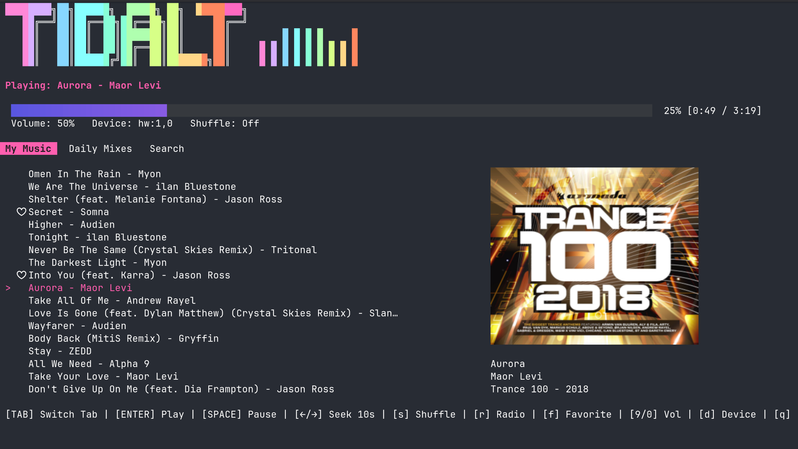
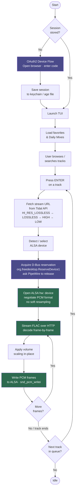

# tidalt



A terminal UI (TUI) for Tidal that delivers **bit-perfect, lossless audio** directly to your DAC — no PipeWire, no PulseAudio, no resampling.

> 100% vibe coded with [Claude](https://claude.ai) and [Gemini](https://gemini.google.com).

---

## Features

- Browse your Tidal favorites and Daily Mixes
- Search tracks by name or paste a Tidal track URL
- Bit-perfect FLAC playback via direct ALSA `hw:` access (bypasses PipeWire/PulseAudio entirely)
- Auto-negotiates the best PCM format your DAC supports (S16\_LE → S24\_3LE → S24\_LE → S32\_LE)
- Auto-advances through the queue when a track ends
- Volume control persisted between sessions
- Output device selection from within the TUI
- Secure session storage via system keychain (falls back to age-encrypted file)
- PipeWire device reservation via D-Bus (`org.freedesktop.ReserveDevice1`) — politely asks PipeWire to step aside before opening the device
- MPRIS2 media player registration — desktop media keys (play/pause, next, previous) work without the TUI being focused

---

## Platform

**Linux only.** Playback uses the ALSA `hw:` interface via CGO + libasound. macOS and Windows are not supported.

---

## Supported DACs

Auto-detection scans `/proc/asound/cards` for the following devices. Any ALSA-visible device can also be selected manually from within the TUI with the `d` key.

| DAC | Auto-detected |
|-----|:------------:|
| Hidizs S9 Pro | Yes |
| Focusrite Scarlett Solo | Yes |
| Any ALSA-visible device | Manual (`d` key) |

---

## How It Works



### Audio pipeline detail

1. **Stream URL** — The Tidal API is queried for a FLAC stream URL, trying quality tiers from highest to lowest (`HI_RES_LOSSLESS`, `LOSSLESS`, `HIGH`, `LOW`).
2. **FLAC decode** — Frames are decoded in-flight from the HTTP response body using `github.com/mewkiz/flac`. No temporary files, no buffering to disk.
3. **Format negotiation** — The ALSA `hw:` device is opened with the low-level `snd_pcm_hw_params` API (not the convenience wrapper). For 16-bit sources the preference order is `S16_LE → S24_3LE → S24_LE → S32_LE`; for 24-bit sources `S24_3LE → S24_LE → S32_LE`. Soft resampling is disabled — the sample rate must match the stream exactly.
4. **PCM packing** — Samples are packed into the negotiated format with correct sign extension before being written to ALSA.
5. **Xrun recovery** — Buffer underruns are recovered automatically via `snd_pcm_recover`.
6. **PipeWire handoff** — Before opening the `hw:` device, the app acquires `org.freedesktop.ReserveDevice1.Audio{N}` on D-Bus. If PipeWire currently owns the device it is asked to release via `RequestRelease`. The reservation is held for the duration of playback and released on stop.

---

## Getting Started

### Prerequisites

- Go 1.21+
- `libasound2-dev` (ALSA development headers)
- A Tidal HiFi or HiFi Plus subscription

```bash
# Debian / Ubuntu
sudo apt install libasound2-dev

# Arch Linux
sudo pacman -S alsa-lib

# Fedora
sudo dnf install alsa-lib-devel
```

### Install with Go

```bash
go install github.com/Benehiko/tidalt/cmd/tidalt@latest
```

### Build from source

```bash
git clone https://github.com/Benehiko/tidalt.git
cd tidal-hifi
go build -o tidalt ./cmd/tidalt
./tidalt
```

### First run

On first launch you will be prompted to authenticate with Tidal via the OAuth2 device flow:

```
Initiating Tidal Login...

1. Go to: https://link.tidal.com/XXXXX
2. Enter Code: ABCD-1234

Press ENTER to open the link in your browser, or wait for authorization...
```

Your session is saved securely — to the system keychain where available, otherwise to an age-encrypted file at `~/.config/tidalt/secrets`. You will not be asked to log in again until the session expires.

---

## Keybindings

### In-TUI

| Key | Action |
|-----|--------|
| `Tab` | Cycle tabs (My Music → Daily Mixes → Search) |
| `↑` / `k` | Move cursor up |
| `↓` / `j` | Move cursor down |
| `Enter` | Play selected track / load mix / confirm |
| `Space` | Pause / resume |
| `f` | Toggle favorite on selected track |
| `9` | Volume down 5% |
| `0` | Volume up 5% |
| `d` | Open output device selector |
| `Esc` | Close device selector |
| `q` / `Ctrl+C` | Quit |

### Global shortcuts (MPRIS2)

`tidalt` registers as an MPRIS2 media player so playback can be controlled
without the TUI being focused. On keyboards without dedicated media keys, bind
[`playerctl`](https://github.com/altdesktop/playerctl) commands to any key
combination via your desktop environment's global shortcuts. Suggested bindings
for 65% keyboards:

| Shortcut | Command | Action |
|----------|---------|--------|
| `Alt+0` | `playerctl --player=tidalt previous` | Previous track |
| `Alt+-` | `playerctl --player=tidalt play-pause` | Play / pause |
| `Alt+=` | `playerctl --player=tidalt next` | Next track |

See [docs/media-keys.md](docs/media-keys.md) for full setup instructions
including KDE Plasma configuration and troubleshooting.

---

## Data & Storage

| What | Where |
|------|-------|
| OAuth2 session | System keychain or `~/.config/tidalt/secrets` (age-encrypted) |
| Volume & device preference | `~/.local/share/tidalt/tidal-cache.db` |
| Track metadata cache | Same database |

---

## Debugging

Set `TIDALT_DEBUG=true` to enable structured debug logging:

```bash
TIDALT_DEBUG=true tidalt
```

Logs are written to `~/.local/share/tidalt/debug-YYYYMMDD-HHMMSS.log`. Each
run creates a new file. All URLs are written with query strings stripped to
avoid capturing OAuth tokens or stream-signing parameters.

```bash
# Follow the latest log in real time
tail -f ~/.local/share/tidalt/debug-*.log
```

See [docs/debugging.md](docs/debugging.md) for the full reference — logged
events, token redaction behaviour, and common error patterns.

---


## Dependencies

| Library | Purpose |
|---------|---------|
| [charmbracelet/bubbletea](https://github.com/charmbracelet/bubbletea) | TUI framework |
| [charmbracelet/bubbles](https://github.com/charmbracelet/bubbles) | Progress bar, text input |
| [charmbracelet/lipgloss](https://github.com/charmbracelet/lipgloss) | Terminal styling |
| [mewkiz/flac](https://github.com/mewkiz/flac) | Pure-Go FLAC decoder |
| [godbus/dbus](https://github.com/godbus/dbus) | D-Bus device reservation (PipeWire handoff) |
| [docker/secrets-engine](https://github.com/docker/secrets-engine) | Secure credential storage |
| [go.etcd.io/bbolt](https://go.etcd.io/bbolt) | Local settings & track metadata cache |
| libasound (CGO) | Direct ALSA `hw:` playback |
