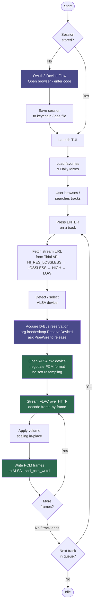

# Architecture

## How it works

## Audio pipeline

1. **Stream URL** — The Tidal API is queried for a FLAC stream URL, trying quality tiers from highest to lowest (`HI_RES_LOSSLESS`, `LOSSLESS`, `HIGH`, `LOW`).
2. **FLAC decode** — Frames are decoded in-flight from the HTTP response body using `github.com/mewkiz/flac`. No temporary files, no buffering to disk.
3. **Format negotiation** — The ALSA `hw:` device is opened with the low-level `snd_pcm_hw_params` API (not the convenience wrapper). For 16-bit sources the preference order is `S16_LE → S24_3LE → S24_LE → S32_LE`; for 24-bit sources `S24_3LE → S24_LE → S32_LE`. Soft resampling is disabled — the sample rate must match the stream exactly.
4. **PCM packing** — Samples are packed into the negotiated format with correct sign extension before being written to ALSA.
5. **Xrun recovery** — Buffer underruns are recovered automatically via `snd_pcm_recover`.
6. **PipeWire handoff** — Before opening the `hw:` device, the app acquires `org.freedesktop.ReserveDevice1.Audio{N}` on D-Bus. If PipeWire currently owns the device it is asked to release via `RequestRelease`. The reservation is held for the duration of playback and released on stop.

## Package overview

| Package | Description |
|---------|-------------|
| `cmd/tidalt` | Entry point. Subcommands: TUI, `daemon`, `play`, `setup`, `setup --daemon`. Session load/restore, OAuth2 device-flow login. |
| `internal/tidal` | Tidal API client. OAuth2 auth, token refresh, REST calls (favorites, search, stream URL, mixes, radio). |
| `internal/player` | Bit-perfect FLAC playback via CGO + libasound. Direct ALSA `hw:` access, PCM format negotiation, PipeWire reservation, seek. |
| `internal/store` | Persistent storage. OAuth2 session in system keychain (falls back to age-encrypted file). Volume, device, position, and track cache in bbolt. |
| `internal/ui` | BubbleTea TUI. Browse/search/mixes/device-select states, progress bar, logo animation. Runs headless in daemon mode. |
| `internal/mpris` | MPRIS2 D-Bus server + client. Media-key commands, `io.tidalt.App` private interface for client↔server communication. |

## Dependencies

| Library | Purpose |
|---------|---------|
| [charmbracelet/bubbletea](https://github.com/charmbracelet/bubbletea) | TUI framework |
| [charmbracelet/bubbles](https://github.com/charmbracelet/bubbles) | Progress bar, text input |
| [charmbracelet/lipgloss](https://github.com/charmbracelet/lipgloss) | Terminal styling |
| [mewkiz/flac](https://github.com/mewkiz/flac) | Pure-Go FLAC decoder |
| [godbus/dbus](https://github.com/godbus/dbus) | D-Bus (PipeWire reservation + MPRIS2) |
| [docker/secrets-engine](https://github.com/docker/secrets-engine) | Secure credential storage |
| [go.etcd.io/bbolt](https://go.etcd.io/bbolt) | Local settings & track metadata cache |
| libasound (CGO) | Direct ALSA `hw:` playback |
